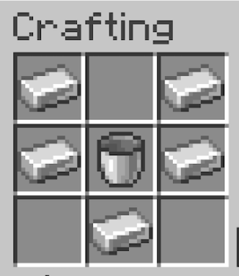

# Fluid Hopper Plugin

Welcome to the **Fluid Hopper** plugin! This plugin introduces a new mechanic to Minecraft allowing players to transfer liquids (Lava and Water) through hoppers, creating automation possibilities such as Dripstone Lava Generators that automatically fuel Furnaces.

## Features

* **Custom Fluid Hopper:** A specialized hopper that handles fluids exclusively. It acts as a pipe system for liquids.
* **Fluid Exclusivity:** Fluid Hoppers will strictly reject regular items (like dirt or cobblestone) and will only move "Fluid Items" generated by the plugin.
* **Dripstone & Cauldron Integration:** Fluid Hoppers will automatically extract liquid from full Lava or Water Cauldrons directly above them.
* **Furnace Auto-Fueling:** Fluid Hoppers containing Lava can be pointed directly into a Furnace, Blast Furnace, or Smoker to automatically refill their burn time when they run low.
* **Vanilla Mechanics:** Fluids inside the hoppers are represented as dummy items (`1000mB Lava` / `1000mB Water`), allowing vanilla hopper mechanics to push and pull these fluids through long pipe systems!

## How to Craft

You can craft a Fluid Hopper using the exact same shape as a vanilla hopper, but replace the Chest with an **Empty Bucket**.



## Installation

1. Download the latest `fluid-hopper-1.0-SNAPSHOT.jar` file from the releases (or build it from source).
2. Stop your Minecraft server.
3. Place the `.jar` file into your server's `plugins` folder.
4. Start your server. The plugin will automatically generate a data folder to keep track of your placed Fluid Hoppers.

**Supported Versions:** Paper `1.21.1` and `26.1.2` (and compatible modern versions).

## How to Use (Example: Lava Generator)

The most popular use case for this plugin is creating a fully automated, infinite furnace array using Dripstone!

1. Place a **Lava Cauldron** with Pointed Dripstone above it, and a Lava Source block above the dripstone. Wait for the dripstone to slowly fill the cauldron.
2. Place a **Fluid Hopper** directly underneath the Cauldron.
3. Once the Cauldron is full, the Fluid Hopper will "suck" the lava out of it, storing a `1000mB Lava` item inside itself.
4. Point the Fluid Hopper into a **Furnace**.
5. When the Furnace starts running out of fuel, the Fluid Hopper will consume the lava and grant the furnace a massive `20,000` ticks of burn time (equivalent to a Lava Bucket) without leaving any empty buckets behind!

*Note: You can chain multiple Fluid Hoppers together to move fluid over long distances!*

## Commands & Permissions

* `/fluidhopper give` - Gives the executing player a Fluid Hopper directly into their inventory.
  * **Permission:** `fluidhopper.admin`

*Note: Normal players cannot extract the "dummy" fluid items from the hopper GUI. Only administrators with the `fluidhopper.admin` permission can interact with the fluid items directly.*

## Building from Source

If you wish to compile the plugin yourself:

1. Ensure you have Java 21+ (or Java 25) installed.
2. Clone this repository.
3. Run the Gradle build wrapper:
   ```bash
   ./gradlew build
   ```
4. The compiled plugin will be located in `build/libs/fluid-hopper-1.0-SNAPSHOT.jar`.

## Support

Do you like our work? Support us on [Ko-Fi](https://ko-fi.com/eyeskiller)!
